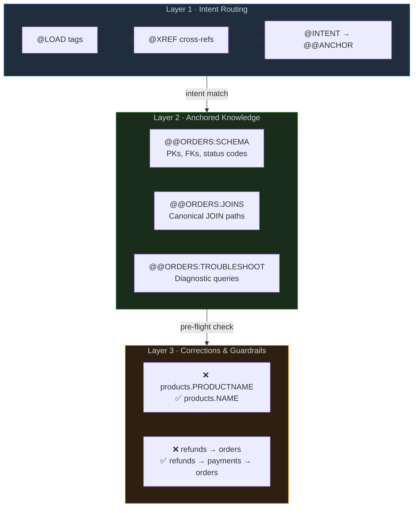
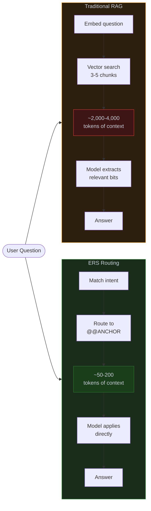
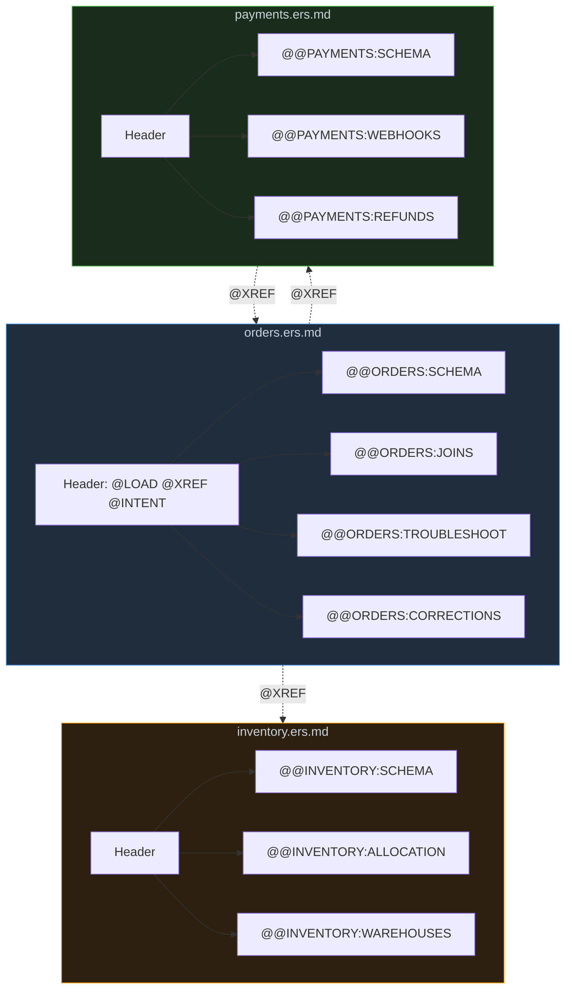

# Stop Feeding Your Agents Prose — Structure Your Knowledge Like Code

*Why the bottleneck in AI agent performance isn't the model — it's how you organize what the model knows.*

---

## The Expensive Illusion

There's a quiet assumption in the AI engineering community: if your agent isn't performing well, upgrade the model. Move from GPT-4o-mini to Claude Opus. Swap Grok Fast for Gemini Ultra. Throw more parameters at the problem.

It works. Briefly. Then the next edge case appears, and you're back to prompt engineering, adding more context, burning more tokens, and wondering why a model that can write poetry still can't reliably construct a four-table SQL JOIN across your order, inventory, and shipping tables.

The problem was never the model's intelligence. It was the shape of the knowledge you handed it.

---

## A Familiar Scene

Picture this. You're building an agent that operates across your company's platform — an order management service, a payments gateway, an inventory system, a shipping provider, maybe a CRM feeding them all. Forty-something microservices. Six databases. Three third-party APIs. Your agent needs to answer questions like:

- *"Show me all failed orders for this customer in the last 8 hours"*
- *"What's the fulfillment status across all warehouses for this SKU?"*
- *"Why was this refund rejected?"*

So you do the reasonable thing. You write documentation. Markdown files describing your database schema. README files explaining API endpoints. Relationship guides mapping foreign keys. Runbooks for common troubleshooting patterns.

You dump it all into a vector database, wire up RAG, and ask the agent to answer questions.

It works — 60% of the time. The other 40%, it hallucinates column names, invents JOIN paths that don't exist, or confidently returns a query using `products.PRODUCTNAME` when the actual column is `products.NAME`. It confuses the `payments` service API with the `billing` database schema. It cites a runbook step that was rewritten two sprints ago.

You've given the agent a library. What it needed was a filing cabinet with labeled drawers.

---

## The Core Insight: Models Don't Need More Knowledge — They Need Structured Access

Large language models are remarkably good at reasoning *within constraints*. Give a model a precise, bounded context with explicit relationships, and even a small, fast model will produce accurate, domain-specific output. Give that same model a sprawling, 2,000-line markdown document full of prose, and even an expensive frontier model will miss critical details buried in paragraph seven of section four.

This is the insight behind what I call **ERS — Extension Routing Structure**.

ERS is not a framework. It's not a library. It's a *convention* — a way of organizing domain knowledge so that agents (and the retrieval systems feeding them) can find exactly what they need, at the right granularity, with zero ambiguity.

Think of it as **structured knowledge engineering for the age of AI agents**.

---

## The Anatomy of ERS

An ERS knowledge pack has three layers:



### Layer 1: The Header Block (Intent Routing)

Every knowledge file begins with a machine-readable header that declares:
- **What topics it covers** (load tags)
- **What other files it relates to** (cross-references)
- **What questions it answers** (intent → anchor mapping)

```
# EXT:ORDER_DB:v1
@LOAD schema|query|order|product|customer|fulfillment|payment
@XREF payments-api, inventory-service
@INTENT order.lookup -> @@ORDER_DB:ORDERS
@INTENT join.pattern -> @@ORDER_DB:JOINS
@INTENT column.correction -> @@ORDER_DB:CORRECTIONS
```

This header is the *routing table*. When a retrieval system — whether RAG, a tool-use agent, or a simple grep — encounters a question about "failed orders," it doesn't need to scan the entire file. It reads the header, matches the intent, and jumps to the right anchor.

### Layer 2: Anchored Sections (The Actual Knowledge)

Each anchor wraps a self-contained unit of knowledge. Everything the agent needs for that specific intent is *inside the anchor*. No context from other sections required. No "see above" references.

```
@@ORDER_DB:ORDERS
@START@@@ORDER_DB:ORDERS ->grep={order, ORDERKEY, customer, status, fulfillment, payment}
orders PK=ORDERKEY; status: 1=pending 2=confirmed 3=shipped 4=delivered 5=cancelled.
FK: orders.CUSTOMERKEY→customers.CUSTOMERKEY; orders.WAREHOUSE_ID→warehouses.WAREHOUSE_ID.
Active filter: WHERE status NOT IN (4,5).
Fullfillment path: orders→order_items(ORDERKEY)→inventory(SKU)→warehouses(WAREHOUSE_ID).
Payment path: orders→payments(ORDERKEY)→refunds(PAYMENT_ID).
@END@@@ORDER_DB:ORDERS
```

Notice what's happening:
- **No prose**. Just the facts.
- **Grep hints** in the anchor tag. A retrieval system can match on keywords without even parsing the content.
- **Self-contained**. The FK relationships, status codes, and canonical JOIN paths are all right here.

### Layer 3: Corrections and Guardrails (Error Prevention)

This is the layer most knowledge systems skip entirely, and it's the one that matters most for agent reliability.

```
@@ORDER_DB:CORRECTIONS
@START@@@ORDER_DB:CORRECTIONS ->grep={WRONG, CORRECT, column, name, price}
CRITICAL: products.PRODUCTNAME does not exist. Use products.NAME.
CRITICAL: orders.TOTAL is the pre-tax amount. For final price use orders.GRAND_TOTAL.
CRITICAL: refunds FK is refunds.PAYMENT_ID→payments.PAYMENT_ID (NOT refunds.ORDER_ID).
@END@@@ORDER_DB:CORRECTIONS
```

These aren't documentation. They're **anti-hallucination anchors**. By explicitly encoding common mistakes and their corrections, you give the agent a pre-flight checklist.

---

## Why This Works: The Token Economics of Precision



With ERS the context window shrinks by 10–20x. This has two effects:

**For expensive models**: You're spending 90% less per query. At scale — thousands of agent calls per day — this is the difference between a viable product and a budget crisis.

**For cheap models**: You're removing the noise that causes them to fail. A fast, inexpensive model with 200 tokens of precise context will outperform a frontier model with 4,000 tokens of loosely relevant prose.

This is the counterintuitive result: **structured knowledge is a model equalizer.** It narrows the performance gap between a $0.002/call model and a $0.06/call model, because the task shifts from "comprehend and extract" to "read and apply."

---

## ERS in Practice: Patterns That Emerged

### Pattern 1: One File, One Domain, Many Anchors



The sweet spot is **one file per knowledge domain**, with anchored sections inside. Each anchor is independently retrievable, but they live in a single file that can be loaded as a unit when the agent needs deep context.

### Pattern 2: Flatten Everything the Agent Touches

Before (human-friendly):
```markdown
### Orders Table
**Primary Key:** `ORDERKEY`
**Foreign Keys:**
- `CUSTOMERKEY` → `customers.CUSTOMERKEY`
- `WAREHOUSE_ID` → `warehouses.WAREHOUSE_ID`
```

After (agent-efficient):
```
Orders PK=ORDERKEY. FK: CUSTOMERKEY→customers.CUSTOMERKEY; WAREHOUSE_ID→warehouses.WAREHOUSE_ID.
```

Same information. ~40% fewer tokens. No structural ambiguity for the model to resolve.

### Pattern 3: Encode the Mistakes, Not Just the Truth

The most impactful section in any ERS knowledge pack is the **CORRECTIONS** anchor. It's a short list of things the agent *will* get wrong if not told otherwise. This single anchor eliminates more errors than pages of correct documentation.

### Pattern 4: Cross-Reference, Don't Duplicate

```
@XREF payments-api -> for Stripe/Adyen webhook reference
@XREF inventory-service -> for warehouse allocation logic
@XREF shipping-rules -> for carrier selection and SLA mappings
```

The knowledge stays in one place. No drift. No contradictions.

### Pattern 5: Grep Hints Are Retrieval Accelerators

Every anchor includes a `->grep={}` hint — keywords describing the anchor's content. This makes ERS retrieval-system agnostic: it works with sophisticated RAG pipelines and with a shell script that greps a file.

---

## The Bigger Picture: Knowledge as an Engineering Discipline

ERS is an argument that the knowledge engineering layer deserves the same rigor we apply to code:
- **Versioned** (the header declares a version)
- **Testable** (anchors can be validated for completeness)
- **Composable** (packs can cross-reference without coupling)
- **Minimal** (every token earns its place)

---

## Getting Started: The 30-Minute ERS Migration

**Step 1: Audit** — Read your docs as if you were a model with a 200-token attention span.

**Step 2: Identify Domains** — Group your knowledge into coherent domains. Each domain becomes one ERS file.

**Step 3: Write the Header** — Map each question to a future anchor name.

**Step 4: Anchor the Content** — Wrap each knowledge unit in `@START@@@`/`@END@@@` tags. Flatten prose to facts. Add grep hints.

**Step 5: Add Corrections** — Encode what an agent *will* get wrong explicitly.

**Step 6: Delete the Rest** — If content isn't in an anchor, it doesn't exist to the agent.

---

## Final Thought

The most powerful prompt engineering technique isn't a clever system message or a chain-of-thought instruction. It's ensuring the model sees *exactly* the right knowledge, *at exactly* the right moment, *in exactly* the right shape.

**Structure your knowledge like you structure your code. Your agents will thank you — and your budget will too.**

---

*ERS (Extension Routing Structure) is an open convention developed through real-world production experience building AI agents. Adapt it, rename it, improve it. The goal isn't a standard — it's a conversation about taking knowledge engineering as seriously as we take software engineering.*
