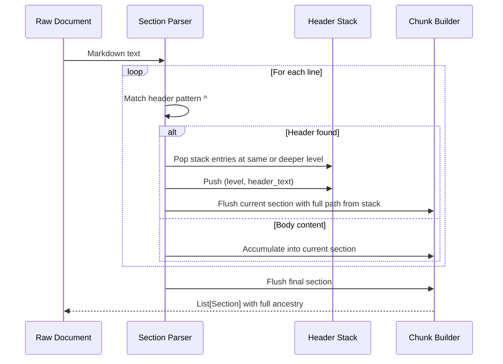
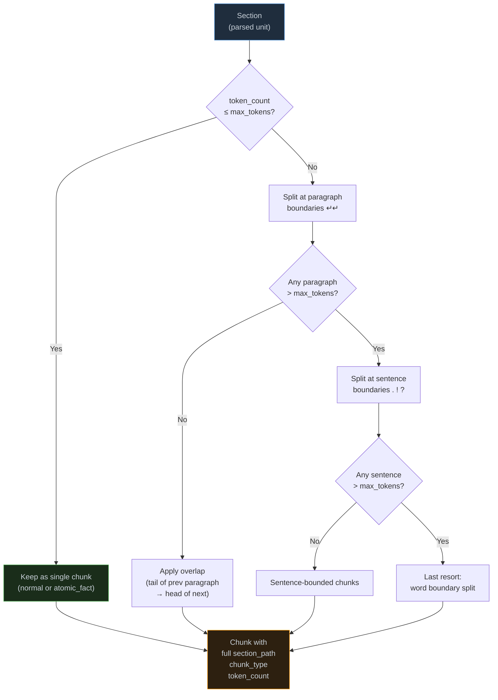
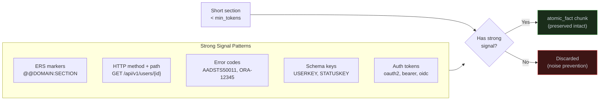
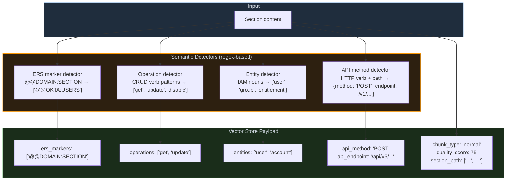
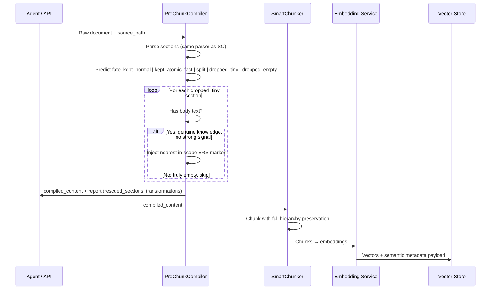
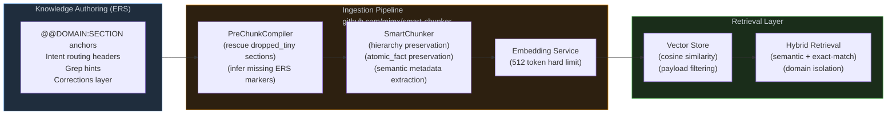

*Why generic text splitting is the wrong abstraction for identity and access management knowledge, and what a structure-aware approach looks like in practice*

---

## Preface

This article is the second in a two-part series on building AI-native knowledge systems for technical operations domains. The first article — [*Stop Feeding Your Agents Prose: Structure Your Knowledge Like Code*](https://mimx.org/posts/stop-feeding-your-agents-prose/) — introduced **ERS (Extension Routing Structure)**, a convention for organizing domain knowledge so agents can retrieve it with precision. That piece argued that structured, anchor-based knowledge is a model equalizer: it narrows the performance gap between cheap and expensive models by ensuring the model sees exactly the right content at exactly the right moment.

This article goes one layer deeper. ERS describes *how knowledge should be organized*. What we examine here is *how that knowledge gets from a raw document into a retrieval system without losing the structure that makes it valuable* — and why the dominant approach to this problem, fixed-size text chunking, is particularly catastrophic for technical operations domains.

The observations and design decisions described here emerged from real-world work building a semantic retrieval system over identity and access management (IAM) documentation. The implementation — `SmartChunker` and `PreChunkCompiler` — is available as open-source at [github.com/mimx/smart-chunker](https://github.com/mimx/smart-chunker). The lessons generalize to any domain where knowledge is dense, hierarchical, and operationally critical.

---

## Part I: The Problem With "Just Chunk It"

### What Generic Chunkers Do

The standard approach to preparing documents for vector retrieval is straightforward: split the document into fixed-size windows, embed each window, store the vectors. Most implementations choose a window size (512 tokens is common, matching popular embedding model limits), add optional overlap between windows, and call it done.

This works well for general-purpose corpora — news articles, Wikipedia entries, product descriptions. It fails systematically for technical operations documentation for three compounding reasons.

---

### Failure Mode 1: The Guillotine Problem

Fixed-size chunkers are indifferent to semantic boundaries. They split at the token limit whether that falls between two sentences, inside a code block, or in the middle of a JSON payload. The result is fragments that are syntactically incomplete and contextually orphaned.

Consider a runbook section that reads:

```
## Disabling a User Account

To suspend access immediately, call the lifecycle endpoint with the following parameters.
The response must return HTTP 200 before downstream systems are notified.

POST /api/v1/users/{userId}/lifecycle/suspend
Authorization: Bearer {token}
Content-Type: application/json

Expected response:
{"status": "SUSPENDED", "userId": "...", "modifiedAt": "..."}
```

A 512-token chunker might split this into:
- **Chunk A**: The prose instruction + the HTTP method line
- **Chunk B**: The authorization headers + response payload

Chunk A has the *intent* but is missing the *complete API specification*. Chunk B has parameters but no context for what they do or when to use them. An agent retrieving Chunk B to answer "how do I suspend a user account?" gets parameters without purpose.

The damage is invisible in offline testing. Both chunks embed near the right vectors. Both score well on semantic similarity. But at inference time, the agent must either hallucinate the missing context or ask a follow-up question — neither of which surfaces during development.

---

### Failure Mode 2: The Orphan Problem

Fixed-size chunking destroys hierarchical context. A document on "Identity Provisioning Architecture" might have the following structure:

```
# Identity Provisioning Architecture
## Lifecycle States
### Active
### Suspended
### Terminated
## Provisioning Workflows
### New Hire Flow
### Rehire Flow
### Transfer Flow
## Error Handling
### Retry Logic
### Dead Letter Queue
```

When this document is split into uniform windows, a chunk about retry logic might contain no information about *which* workflow it applies to, *which* system it governs, or *what* error conditions trigger it. The section header breadcrumb — `Identity Provisioning Architecture > Error Handling > Retry Logic` — is destroyed at chunk boundaries.

In IAM systems specifically, this matters enormously. The retry logic for a new hire provisioning workflow (where a delay is acceptable) is operationally different from the retry logic for an emergency access revocation (where a delay may be a security incident). Orphaned chunks homogenize these distinctions.

---

### Failure Mode 3: The Signal Burial Problem

IAM documentation contains a class of high-value, short-form facts that are retrievable only through exact or near-exact matching:

- Error codes: `AADSTS50011`, `E0000001`, `ORA-12545`
- API endpoint paths: `POST /ECM/api/v5/approveRejectRequest`
- Status codes with operational semantics: `statuskey=1` means active; `statuskey=0` means inactive
- Role identifiers: `ROLE_ADMIN`, `ROLE_ENDUSER`
- Schema keys with cross-system joins: `USERKEY`, `ACCOUNTKEY`, `ENDPOINTKEY`

A generic chunker that encounters a 40-word section documenting that `statuskey=1` indicates an active account has three options: (1) keep it as a standalone 40-word chunk, violating the minimum-size threshold that prevents noise, (2) merge it into an adjacent section where it loses its identity, or (3) discard it because it's below the noise floor.

All three options are wrong. A single fact — `statuskey=1 → active` — is one of the highest-value retrievable artifacts in an IAM knowledge base. It is the difference between an agent that generates correct SQL filters and one that returns every user regardless of status.

---

## Part II: Why IAM Documentation Is Especially Fragile

Before examining the solution, it is worth understanding why IAM knowledge is more sensitive to chunking quality than most other technical domains.

### Characteristic 1: Cross-System Terminology Collision

IAM engineers operate across multiple identity platforms simultaneously. Each platform uses its own vocabulary for the same concepts:

| Concept | Platform A | Platform B | Platform C |
|---------|-----------|-----------|-----------|
| User identifier | `login` / `userId` | `username` / `systemUserName` | `sAMAccountName` |
| Account status | `status: ACTIVE/DEPROVISIONED` | `statuskey: 1/0` | `userAccountControl` flags |
| Group membership | `groups` resource | `entitlements` + `accounts` | `memberOf` attribute |
| Lifecycle event | `user.lifecycle.activate` | `UPDATEACCOUNT` task type | attribute modification |

A chunk containing the word "suspend" means something different depending on which platform it describes. Semantic embeddings, trained on general text, cannot reliably distinguish these unless the chunk also carries domain context.

### Characteristic 2: Procedural Knowledge Requires Complete Sequences

Many IAM operations are multi-step procedures where partial information is more dangerous than no information. Consider a password reset workflow:

1. Verify caller identity through secondary channel
2. Set temporary credential with 24-hour expiration
3. Force MFA re-enrollment at next login
4. Log the event with reason code to audit trail

If a fixed-size chunker splits this into two chunks — steps 1–2 in one chunk, steps 3–4 in another — an agent retrieving only the first chunk will execute an incomplete procedure. In an identity system, an incomplete procedure means an account that appears reset but has no forced MFA re-enrollment: a security gap created by a retrieval failure.

### Characteristic 3: Schema Keys Are Relational, Not Standalone

IAM databases are relational. A table like `entitlement_values` joins to `accounts` via `ACCOUNTKEY`, which joins to `users` via `USERKEY`, which joins to `endpoints` via `ENDPOINTKEY`. These relationships cannot be inferred from a single chunk that mentions only one table. A chunker that splits schema documentation into per-table chunks produces a retrieval problem: an agent asking "how do I find which users have access to a specific application?" needs the JOIN path across three tables, but each table's chunk appears independently without referencing the others.

---

## Part III: The Design of a Structure-Aware Chunker

The failures above share a common root cause: chunkers that treat documents as flat sequences of tokens rather than structured knowledge artifacts. The solution is a chunker that understands document structure, preserves hierarchy, and applies domain-specific preservation rules.

What follows is a detailed examination of one such design — **SmartChunker** ([github.com/mimx/smart-chunker](https://github.com/mimx/smart-chunker)).

### Design Principle 1: Parse Structure Before Splitting

The SmartChunker's first operation on any document is not to count tokens — it is to parse the document's hierarchical structure. For Markdown documents (the dominant format for technical documentation), this means building a complete header stack from H1 through H6.



The key data structure is the **header stack**: a running list of `(level, header_text)` tuples that tracks all open ancestor sections. The `full_path` of every section is derived from the stack at the moment the section begins.

The result is that every section carries its complete genealogy. A section titled "Retry Logic" inside "Error Handling" inside "Provisioning Workflows" inside "Identity Provisioning Architecture" knows its full path: `["Identity Provisioning Architecture", "Provisioning Workflows", "Error Handling", "Retry Logic"]`. This ancestry is attached to every chunk produced from this section.

This is not a cosmetic feature. It is the mechanism by which an agent can distinguish "retry logic for provisioning" from "retry logic for authentication" even when both chunks match the same semantic query about error handling.

---

### Design Principle 2: Token Budgets Per Document Type

Not all technical documentation has the same information density. An API reference contains dense, short, high-specificity content. A standard operating procedure contains narrative prose that only makes sense at higher granularity. A conceptual overview contains definitions that, if chopped too small, lose their meaning.

SmartChunker uses a **configuration registry** that defines separate token budgets per document class:

| Document Type | Target Tokens | Max Tokens | Min Tokens | Overlap | Rationale |
|---------------|--------------|------------|------------|---------|-----------|
| `default` | 350 | 480 | 100 | 50 | Balanced for mixed documentation |
| `api_reference` | 180 | 360 | 40 | 10 | Dense; one endpoint = one chunk |
| `json` | 130 | 260 | 30 | 0 | Structured; no overlap needed |
| `sop` | 220 | 440 | 80 | 30 | Procedural; larger context windows |
| `concept` | 430 | 470 | 150 | 80 | Definitional; high overlap |
| `incident` | 270 | 430 | 80 | 40 | Time-series; moderate overlap |

The `api_reference` profile's low minimum (40 tokens) reflects the fact that a single-line API endpoint specification is a complete, self-contained fact worth preserving regardless of its token count. The `concept` profile's high overlap (80 tokens) reflects that definitions build on each other, and a chunk that begins mid-definition needs enough previous context to be intelligible.

The document type is determined automatically from the document's content and source path using a classifier that looks for HTTP method patterns, numbered step sequences, and JSON key density.

---

### Design Principle 3: A Four-Level Split Cascade

When a section exceeds the maximum token budget, SmartChunker applies a **four-level cascade of splits**, each respecting progressively finer structural boundaries:



The cascade guarantees that no chunk is produced from a mid-sentence or mid-code-block split unless the sentence itself exceeds the token budget. The **overlap mechanism** operates on paragraph boundaries rather than token offsets — repeating the last complete paragraph that fits within the overlap budget, not a truncated fragment.

---

### Design Principle 4: Strong-Signal Preservation

This is the design decision most critical for IAM knowledge specifically.

The minimum token threshold exists to prevent noise. But applying it uniformly would destroy some of the most valuable facts in an IAM knowledge base.

SmartChunker implements a **strong-signal detection pass** that exempts certain short sections from the minimum threshold. A section below the minimum is preserved — with `chunk_type = "atomic_fact"` — if it contains any of the following:



The `atomic_fact` type signals to the retrieval layer that this chunk is a high-density, low-verbosity fact — the kind that should rank highly for exact-match queries even when its semantic embedding is less distinctive than a richer prose chunk.

The practical effect: a 35-token section documenting that `statuskey=1` means active, `statuskey=0` means inactive, and `statuskey=2` means locked is preserved intact, tagged `atomic_fact`, and retrievable. Without this rule, it is discarded as noise.

---

### Design Principle 5: Semantic Metadata Extraction

For every section, SmartChunker runs a set of regex-based detectors that produce **semantic metadata stored alongside the vector in the payload**. This metadata enables hybrid retrieval: semantic similarity plus structured filtering.



This metadata serves multiple retrieval scenarios:

**Exact domain filtering**: A query tagged with `@@OKTA:USERS` retrieves only chunks from the Okta user management domain. No cross-platform contamination.

**Intent-based filtering**: A query with `operations=["disable"]` retrieves only chunks discussing disabling/deactivating entities, not conceptual overviews.

**API precision filtering**: A query specifying `api_method="POST"` and a specific endpoint retrieves exactly the right API documentation.

---

### Design Principle 6: The Pre-Chunk Compiler

The design principles above share a hidden assumption: that the incoming document is structured well enough for the splitter to work on. In practice, real operational documentation contains many sections that are structurally valid but too short to survive the minimum token threshold.

Consider a knowledge document about a cross-system identifier mapping:

```markdown
## Attribute Mapping

### employeeID
Maps to HR personnel number. This is the authoritative identifier.

### employeeNumber  
Maps to cost center code. NOT the personnel number despite the name.

### loginName
Windows logon name. Equivalent to LDAP uid.
```

Each `###` section is 15–25 tokens — well below any reasonable minimum threshold. Without intervention, all three are discarded as noise. But each one is a critical fact: confusing `employeeID` with `employeeNumber` in an HR sync produces incorrect reporting.

The solution is a **PreChunkCompiler**: a pre-processing step that analyzes the document *before* SmartChunker sees it, predicts which sections will be discarded, and rescues the ones that contain genuine knowledge.



The compiler's intervention is minimal: it injects the nearest **in-scope ERS marker** from the document's own content into the section body. This single addition flips the `_has_strong_signal()` check from `False` to `True`, causing SmartChunker to preserve the section as an `atomic_fact` chunk. The SmartChunker's logic is unchanged. The threshold is unchanged.

The compiler also produces a detailed audit report: how many sections were rescued, which transformations were applied, and which sections remain dropped (genuinely empty structural dividers). This turns knowledge gaps from invisible retrieval failures into explicit, logged events.

---

## Part IV: The Connection to Structured Knowledge Engineering

Readers familiar with the [ERS article](https://mimx.org/posts/stop-feeding-your-agents-prose/) in this series will recognize that SmartChunker and PreChunkCompiler are the *ingestion-time enforcement layer* for ERS's *authoring-time conventions*.



ERS without SmartChunker produces well-structured source documents that get destroyed by a generic chunker on ingestion. SmartChunker without ERS produces well-structured chunks that lack the domain routing markers needed for precise retrieval. Together, they form a coherent pipeline where structure added at authoring time is preserved through ingestion and available at query time.

This co-design reflects a systems engineering principle: **the retrieval system should be designed with knowledge of how its input is structured, and the knowledge structure should be designed with knowledge of how it will be retrieved**. When these two are designed independently and composed naively, failure modes at their interface are inevitable.

---

## Part V: Operational Evidence

### The Retrieval Quality Outcome

Consider two queries against the same IAM knowledge base, with two retrieval configurations:

**Query: "statuskey values and their meaning"**

*Fixed-size chunker result*: This information lives in a 22-word section. It was merged into an adjacent 150-word section about account status updates. The query returns three chunks about updating account status, with the status code definition buried in each one's text.

*Structure-aware result*: The 22-word section was preserved as an `atomic_fact` chunk. It ranks first for this query because its *only* content is status code definitions — there is no semantic noise.

**Query: "sequence of steps to disable a user across two systems"**

*Fixed-size chunker result*: Each platform's disable procedure is split across chunks. The agent receives fragmented procedures with orphaned context.

*Structure-aware result*: Each platform's procedure stays intact within its token budget. Both chunks carry their full `section_path`, and retrieval filtering on `operations=["disable"]` and `entities=["user"]` surfaces both without contamination.

---

### The Quality Score as a Retrieval Signal

SmartChunker computes a **signal-density quality score** for every chunk:

| Signal Present | Score Contribution |
|---------------|-------------------|
| Baseline | +50 |
| ERS markers present | +15 |
| Entity keywords present | +2 per entity, capped at +10 |
| API method + endpoint pair | +10 |
| CRUD operation verbs | +2 per operation, capped at +10 |
| `atomic_fact` type | +5 |
| `document_summary` type | +5 |
| Token count below 50 | -10 |

A chunk documenting a specific API endpoint with entities and operation verbs scores 90. A prose section explaining the general philosophy of the same system scores 50. The quality score breaks ties in favour of operational specificity.

---

## Part VI: What This Architecture Gets Right

**Reversibility**: Version stamping (`ingestion_version: "smart_chunker_v1.2"`) on every chunk means the corpus can be re-indexed selectively when chunking logic changes. Chunks from different versions coexist; queries can filter by version during A/B testing.

**Observability**: The PreChunkCompiler's audit report gives precise visibility into what happened to each document. The `rescued_sections` count, the list of `transformations` applied, and the `remaining_dropped` sections are all available at ingestion time. This turns knowledge gaps from invisible retrieval failures into explicit, logged events.

**Graceful degradation**: Every design decision has a fallback. The real tokenizer is optional; when unavailable, the `words × 1.3` estimator provides a reasonable approximation. The ERS marker is optional; when absent, the compiler infers one from the document's content and path.

---

## Closing Remarks

The problems described in this article — guillotine splits, orphaned hierarchy, buried signals — are not edge cases. They are the default behavior of generic chunking applied to technical operations documentation. The consequences are invisible in development but systematically damaging in production.

The structure-aware approach described here is an argument that **chunking is a domain-specific engineering problem, not a hyperparameter**. The right chunk boundaries for an API reference are not the right chunk boundaries for a conceptual overview or an incident postmortem. The right minimum size for a status code table is not the right minimum size for a multi-step provisioning procedure.

These decisions require understanding the knowledge domain, not just the token limit. They require co-designing the authoring conventions with the ingestion pipeline. And they require observability at ingestion time.

The ERS convention provides the authoring framework. SmartChunker provides the ingestion-time preservation engine. The code is at [github.com/mimx/smart-chunker](https://github.com/mimx/smart-chunker) — MIT licensed, no dependencies beyond the Python standard library.

---

*This article is part of a series on knowledge engineering for AI-native operational systems. Related reading: [Stop Feeding Your Agents Prose — Structure Your Knowledge Like Code](https://mimx.org/posts/stop-feeding-your-agents-prose/), which introduces the ERS authoring convention that this ingestion pipeline is designed to preserve.*
